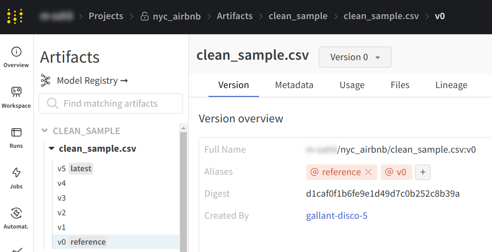
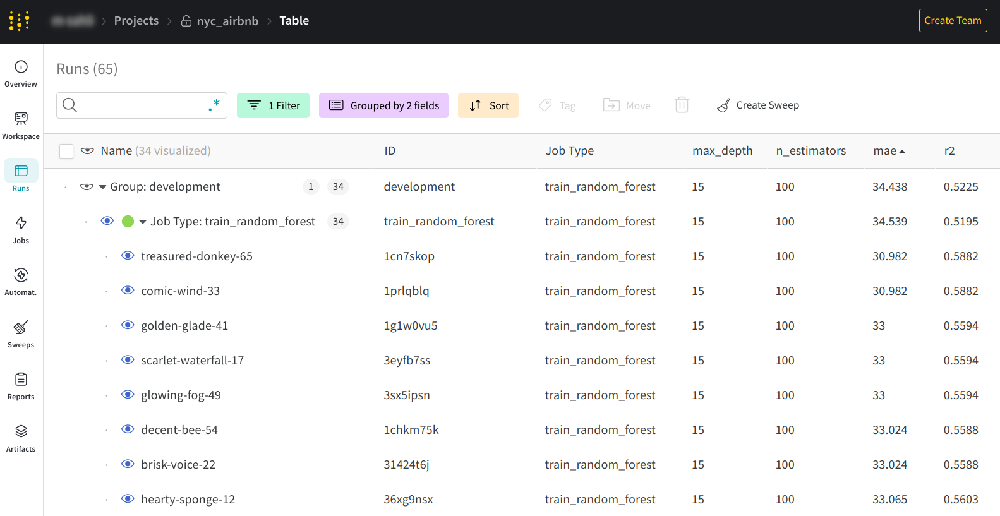
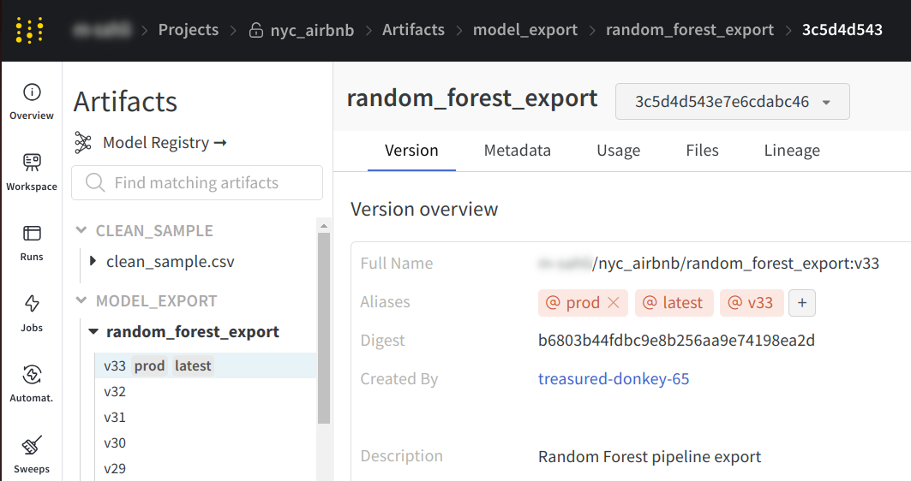
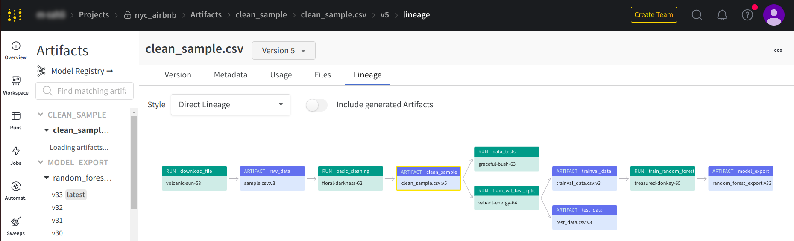
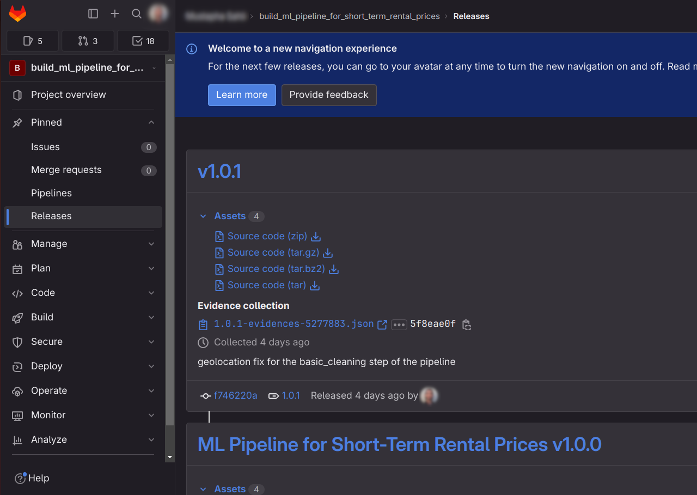
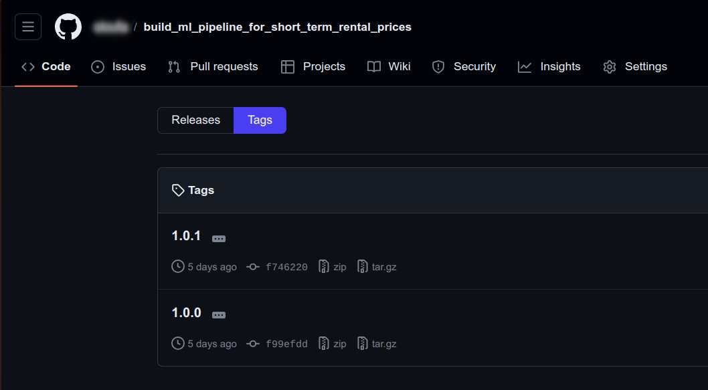

# Build an ML Pipeline for Short-Term Rental Prices in NYC

- [🔗 link to the W&B project](https://wandb.ai/m-sahli/nyc_airbnb)
- [🔗 link to the GitLab repository](https://gitlab.com/m.sahli/build_ml_pipeline_for_short_term_rental_prices)

> This is the capstone project of the "Building a Reproducible Model Workflow" Udacity course within the ["Machine Learning DevOps Engineer"](https://learn.udacity.com/nanodegrees/nd0821/) nanodegree. Project instructions can be found in the `NOTES.md` file.

## 🎯 Project Overview

You are working for a property management company renting rooms and properties for short periods of time on various platforms. You need to estimate the typical price for a given property based on the price of similar properties. Your company receives new data in bulk every week. The model needs to be retrained with the same cadence, necessitating an end-to-end pipeline that can be reused.

In this project you will build such a pipeline.

  

## 🛠️ Setup

I used a `Taskfile` to document all the tasks of this project in one YAML file, read more about Taskfiles [here](https://taskfile.dev/).  
As follows, the list of tasks included:

| Task                      | Description                                                                                            |
| ------------------------- | ------------------------------------------------------------------------------------------------------ |
| `create_env`              | create the nyc_airbnb_dev conda environment                                                            |
| `remove_env`              | remove the nyc_airbnb_dev conda environment                                                            |
| `list_envs`               | list all available conda environments                                                                  |
| `create_mlflow_step`      | create a new mlflow step under the src/ directory using the template in the cookie-mlflow-step/ folder |
| `install_precommit_hooks` | install the pre-commit git hooks defined in .pre-commit-config.yaml                                    |
| `list_mlflow_envs`        | list all the environments having the mlflow prefix                                                     |
| `remove_mlflow_envs`      | remove \*\*all\*\* the environments having the mlflow prefix                                           |
| `download`                | run the download step of the pipeline                                                                  |
| `eda`                     | run the EDA step of the pipeline                                                                       |
| `data_clean`              | run the data cleaning step of the pipeline                                                             |
| `data_check`              | run the data testing step of the pipeline                                                              |
| `data_split`              | run the data splitting step of the pipeline                                                            |
| `train_model`             | run the model training step of the pipeline                                                            |
| `opt_hyper_params`        | run the hyper-parameters optimization step of the pipeline                                             |
| `prod_model_test`         | run tests against the model we wish to deploy in the prod environment                                  |
| `train_model_new_data`    | trains the released models on new data                                                                 |

> - to execute a particular task, you need to run the following command: `task <task_name>`, e.g. `task create_env`
> - to list all tasks, run `task --list`
> - to get more details on a particular task, run `task --summary <task_name>`, e.g. `task --summary create_env`

## ℹ️ Notes

- Before running the "Data Testing" step, make sure to add the `reference` tag on the `clean_sample.csv` W&B artifact.

  

- In order to find the best model,sort the runs by ascending MAE (Mean Absolute Error) and you'll find the best result at the top

  

- Now that we have identified the best model, click on its name, then go to its artifacts and select the "model_export" output artifact, and add a `prod` tag to it to mark it as "production ready".

  

- when your pipeline is ready for release, its artifacts graph should look like the following:

  

- once released, your releases page should be similar to the following:

  - GitLab
    

        
    

  - GitHub
    

      
    

> note that I used GitLab to release the pipeline and pushed the same repo to both GitLab and GitHub. For some reason, GitLab's releases are shown as Tags in GitHub (not Releases).
